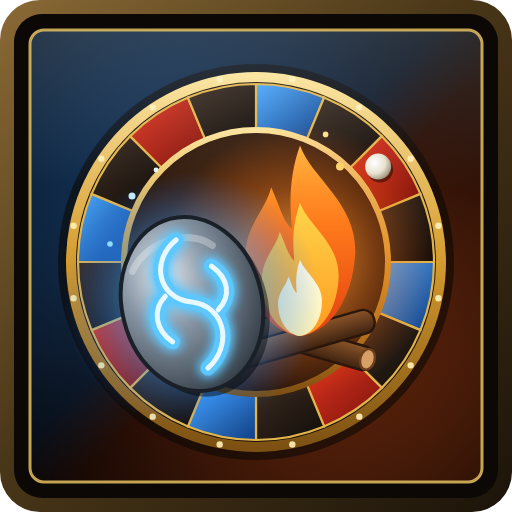

# Hearthstone and Cooking Fire Roulette

**A different way home and a different fire to cook on, every time.**

Hearthstone and Cooking Fire Roulette gives you two macros. **Hearth Roulette** takes you home with a random hearthstone. **Cooking Roulette** places a random cooking fire. After every use, each macro switches to a different one, so your whole collection of hearthstone toys, campfires, braziers and cookpots gets used.

## Features

### Hearthstones

- **A new hearthstone every time.** After each trip home, the macro picks another hearthstone at random. The same one never comes up twice in a row.
- **Only hearthstones you can use.** Picks from the hearthstone toys you've collected, plus the Hearthstone in your bags. Covenant hearthstones and the Draenic Hologem are only picked on characters allowed to use them (see [Good to know](#good-to-know)).
- **A stopped cast moves on.** If you move and interrupt the cast, your next click uses a different hearthstone.

### Cooking fires

- **A new fire every time.** After each fire is placed, the macro picks another one at random. The same fire never comes up twice in a row.
- **Only fires you have.** Picks from the cooking fire toys you've collected, plus the Cooking Fire spell if you know it.
- **Works around cooldowns.** Most fire toys share a cooldown. While they're all cooling down, the macro uses the Cooking Fire spell, then goes back to picking from all your fires once they're ready.
- **A stopped cast moves on.** If a fire's cast is interrupted, your next click places a different fire.

### Both macros

- **Choose what's in the rotation.** Tick or untick any hearthstone or fire in the options. Fires you place by clicking the ground are marked *(click to place)*.
- **Your name, your icon.** Rename each macro and give it a fixed icon, or let it show the next pick's icon. Hovering a macro always shows what it will use next.
- **Combat-safe.** Macros can't be changed in combat, so updates wait until combat ends.

## Getting started

1. Install the addon and log in. It creates two account-wide macros: **Hearth Roulette** and **Cooking Roulette**.
2. Open `/macro` and drag both onto your action bars.
3. Press **Hearth Roulette** to go home, or **Cooking Roulette** to place a cooking fire.

Retail only: the toy box doesn't exist in Classic.

## Options

Type `/hcfr`, or go to **Game Menu → Options → AddOns → Hearthstone and Cooking Fire Roulette**. The options have two tabs, **Cooking Fires** and **Hearthstones**, and each tab sets up its own macro:

- **Macro name**: rename the macro (up to 16 characters, WoW's limit).
- **Macro icon**: click one of the icons to use it for the macro, or **?** to show the upcoming pick's icon. Hover an icon to see what it is.
- **The list**: tick the hearthstones or fires the macro can use, or use **Select all** / **Deselect all**.

If a macro stops changing, type `/hcfr status`. It prints what the addon is doing, which helps when reporting a problem.

## Supported hearthstones

All of these return you to your home inn and share one cooldown.

| Hearthstone |
| --- |
| Hearthstone *(item)* |
| Brewfest Reveler's Hearthstone |
| Broker Translocation Matrix |
| Corewarden's Hearthstone |
| Cosmic Hearthstone |
| Dark Portal |
| Deepdweller's Earthen Hearthstone |
| Dominated Hearthstone |
| Draenic Hologem |
| Enlightened Hearthstone |
| Eternal Traveler's Hearthstone |
| Ethereal Portal |
| Explosive Hearthstone |
| Fire Eater's Hearthstone |
| Greatfather Winter's Hearthstone |
| Headless Horseman's Hearthstone |
| Hearthstone of the Flame |
| Holographic Digitalization Hearthstone |
| Kyrian Hearthstone |
| Lightcalled Hearthstone |
| Lunar Elder's Hearthstone |
| Mycomancer's Hearthspore |
| Naaru's Enfold |
| Necrolord Hearthstone |
| Night Fae Hearthstone |
| Noble Gardener's Hearthstone |
| Notorious Thread's Hearthstone |
| Ohn'ir Windsage's Hearthstone |
| P.O.S.T. Master's Express Hearthstone |
| Path of the Naaru |
| Peddlefeet's Lovely Hearthstone |
| Preyseeker's Hearthstone |
| Redeployment Module |
| Stone of the Hearth |
| The Innkeeper's Daughter |
| Timewalker's Hearthstone |
| Tome of Town Portal |
| Venthyr Sinstone |

## Supported cooking fires

| Fire | Placement |
| --- | --- |
| Cooking Fire *(spell)* | Click to place |
| Akunda's Firesticks | Click to place |
| Brazier of Dancing Flames | Next to you |
| Brazier of Madness | Click to place |
| Cozy Bonfire | Next to you |
| Crystalline Campfire | Next to you |
| Eternal Kiln | Next to you |
| Ever-Abundant Hearth | Click to place |
| Felflame Campfire | Next to you |
| Grim Campfire | Next to you |
| Leylight Brazier | Click to place |
| Little Wickerman | Next to you |
| Maruuk Cooking Pot | Next to you |
| Muckpool Cookpot | Click to place |
| Steamworks Sausage Grill | Next to you |
| Stonebound Lantern | Click to place |
| Tuskarr Traveling Soup Pot | Click to place |

## Good to know

- All hearthstones share one cooldown, so there's nothing to switch to while it runs. The macro shows the next hearthstone right away, ready for when the cooldown ends.
- A covenant hearthstone (Kyrian, Necrolord, Night Fae or Venthyr) works on characters pledged to that covenant, and on all your characters once any of them has reached Renown 80 with it. The Draenic Hologem only works for draenei and Lightforged draenei. On other characters the options explain why, for example *(Night Fae or Renown 80 only)*, and the macro skips them.
- Garrison and Dalaran Hearthstones aren't included, since they take you somewhere other than your home inn.
- *Click to place* fires show a targeting circle; click the ground where you want the fire.
- Most fire toys share a cooldown, so you can't place several toys back to back. That's when the Cooking Fire spell fills in.
- The macros are account-wide, so all your characters share them.
- If all 120 account-wide macro slots are full, the addon can't create a macro and says so in chat.

## License

GPL-3.0. See [LICENSE](LICENSE).
